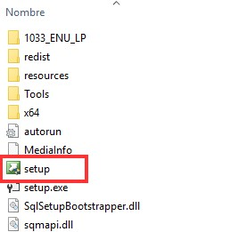
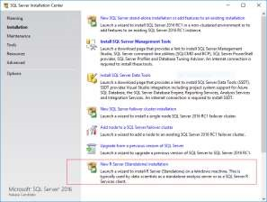
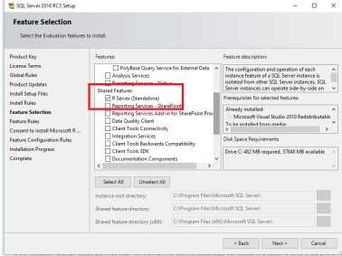
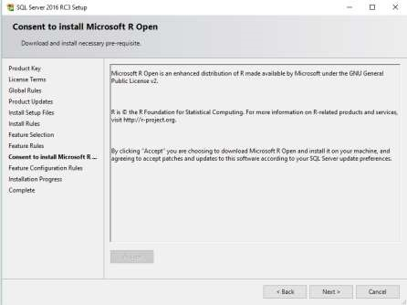
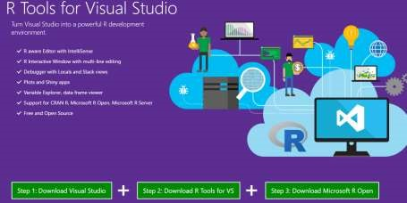
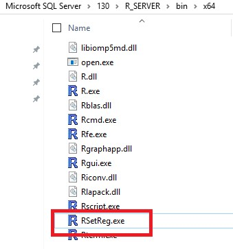

# Set up Data Science client

1.	If have not already done so, download the SQL Server 2016 Developer Edition from here. 
 
    You will want to set up an R development environment that is capable of connecting to the server for remote execution and deployment. 

1.	Run SQL Server setup.  

    

1.  On the Installation tab, click New R Server (Standalone) installation. 
 
    

1.	Click Next until Feature Selection. 

    

1.	On the Feature Selection page, the following option should already be selected: 
    - R Server (Standalone) 

    This option installs shared features, including open source R tools and base packages, and the enhanced R packages and connectivity tools provided by Microsoft R Services. 

1.	Accept the license terms for downloading and installing Microsoft R Open. 

    

1.	Click on Next and install it. 

1.	Open https://www.visualstudio.com/en-us/features/rtvsvs.aspx  

1.	Click on `Download R Tools for VS`. 

    

    Note that if you install R Tools for Visual Studio, in some cases, the add-in will not recognize that the R runtime is installed and will offer to download and install another version of R, such as the 64 bit editions of R 3.2.1, 3.2.2 and 3.2.3 (CRAN R distributions), or the Microsoft R distributions (Microsoft R Open, Revolution R Open). 
 
1.	It is important that you do NOT use the provided links to install a different version of R. Instead, use one of the following options to register the currently installed version of the R runtime: 
    
1.  Run the R utility, RSetReg, and locate the locally installed R runtime version. 

    

1.  Manually create the following registry key: 

    - [HKEY_LOCAL_MACHINE\SOFTWARE\Rcore\R\3.2.2.802 Microsoft R Server] "installPath"="<INSTALLATION_FOLDER>" 

<a href="04.MLKeys.md">Next</a>